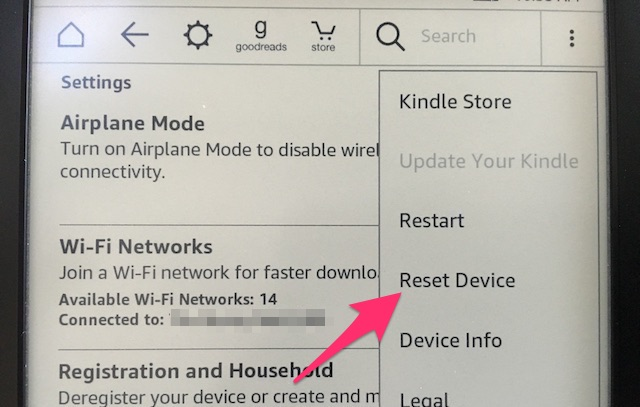

Installing Debian on your Kindle
--------------------------------

# 1. Jailbreaking your Kindle. 
Jailbreaking your Kindle allows non-Amazon applications to run on your Kindle.
In order to Jailbreak your device you need a Paperwhite 2 or 3, Kindle Touch 2 or 3, Kindle Voyage or Kindle Oasis. 
I'm using a Kindle Touch 3.
Follow the steps below to jailbreak your device.

1. Reset your device
  
  First, you need to reset your device to factory defaults. To do this, go to settings and click the menu button
  in the top righthand corner, it should look like this:
  
  
  Resetting your device involves removing all your books, saved passwords and documents, so make sure to backup 
  anything you don't have stored in the cloud. This process may take a while, so go grab a beverage of your choice.

2. Downgrade your Kindle's operating system.

